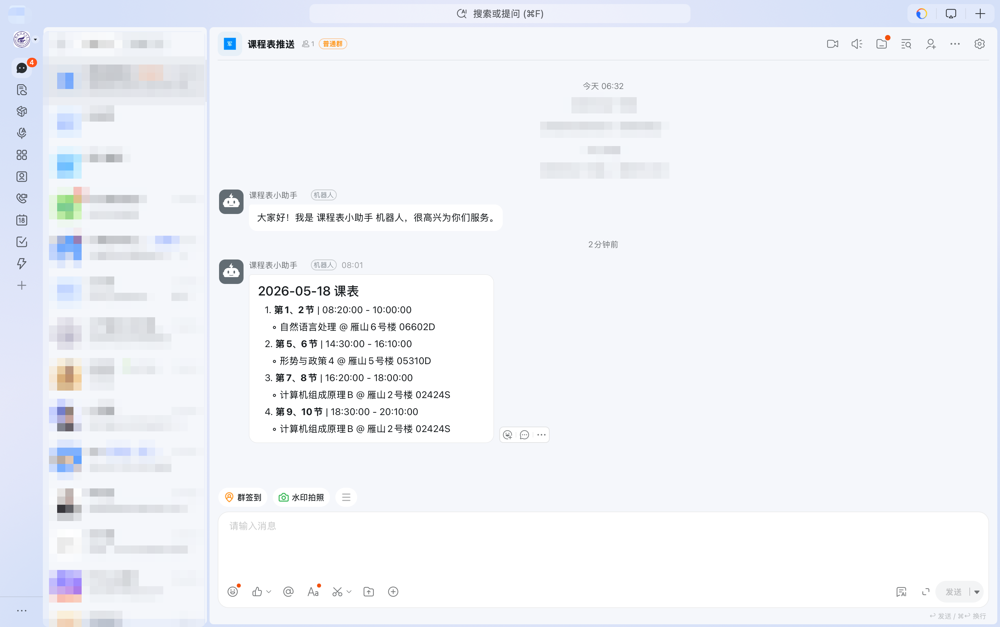
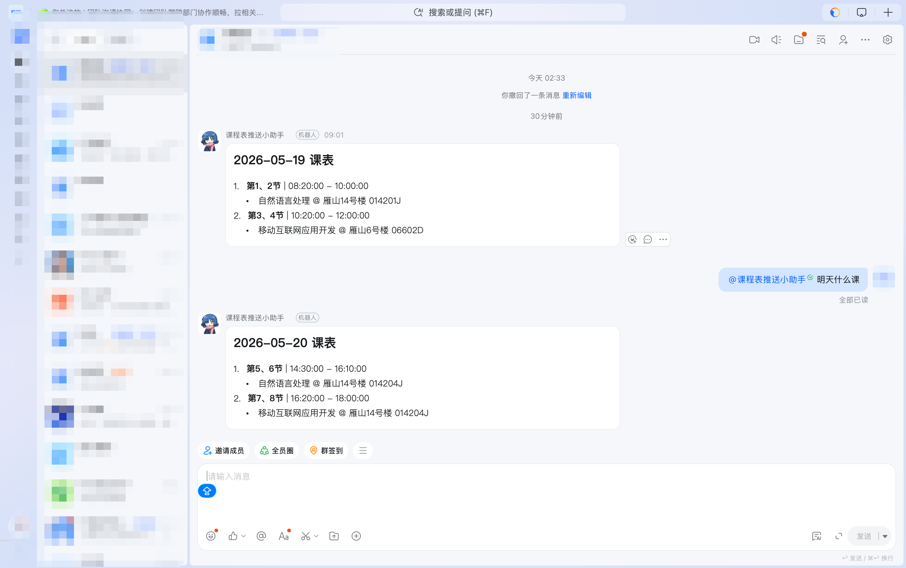
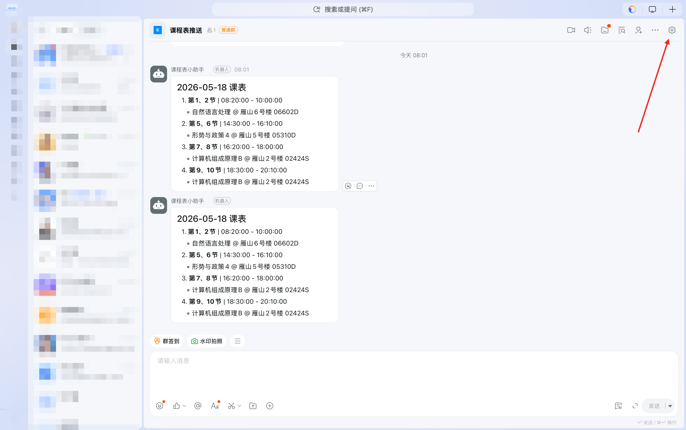

## 前言

受困于某班小程序经常崩溃，修复不及时经常需要登录教务系统查看课表，况且GLUT的各个密码设置要求都不相同，故本人爬取了教务系统的课程表接口结合钉钉群聊机器人实现了课程表的推送以及部署到服务器实现定时推送。
本项目已在[Github](https://github.com/NullSetx/GLUT-Schedule.git "仓库地址")上开源。

本项目仅供技术交流。

## 课程表接口分析

```python

url = "http://jw.glut.edu.cn/academic/j_acegi_security_check"
url_schedule = 'http://jw.glut.edu.cn/academic/personal/currentTodayPlan.do'
```
``url``为教务系统登录接口
``url_schedule``为学生的日常安排接口，可查询课程，考试。


```python
data = {
    "j_username": "学号",
    "j_password": "教务系统密码",
    "j_captcha": "undefined"   
}

params = {
    'currentDate': '2026-5-18',
}


headers = {
    "User-Agent": "Mozilla/5.0",
    "Content-Type": "application/x-www-form-urlencoded",
    "Referer": "http://jw.glut.edu.cn/academic/common/security/login.jsp"
}
```

``data`` 为登录接口请求参数
``params`` 为课程表接口请求参数
``headers`` 为浏览器headers


**原理：** 请求登录接口拿到用户登录的``cookies`` 带着这个``cookies`` 请求``url_schedule``就能拿到指定日期的课程安排。

**示例代码**
```python
import requests

s = requests.Session()

url = "http://jw.glut.edu.cn/academic/j_acegi_security_check"
url_schedule = 'http://jw.glut.edu.cn/academic/personal/currentTodayPlan.do'

data = {
    "j_username": "学号",
    "j_password": "密码",
    "j_captcha": "undefined"   # ✅ 空字符串，不是 undefined
}

headers = {
    "User-Agent": "Mozilla/5.0",
    "Content-Type": "application/x-www-form-urlencoded",
    "Referer": "http://jw.glut.edu.cn/academic/common/security/login.jsp"
}

resp = s.post(url, data=data, headers=headers, allow_redirects=False)


params = {
    'currentDate': '2026-5-18',
}

cookies = s.cookies.get_dict()

response = requests.post(
    url_schedule,
    params=params,
    cookies=cookies,
    headers=headers,
    verify=False,
)


def format_schedule(json_data):
    result = []
    data = json_data.get("data", [])

    if not data:
        return "📭 今天没有课～"

    for idx, item in enumerate(data, start=1):
        time_slot = item.get("time", "")
        name = item.get("name", "")
        building = item.get("resBuildingName", "")
        room = item.get("roomName", "")
        start = item.get("startDate", "").split()[-1]
        end = item.get("endDate", "").split()[-1]

        lesson = (
            f"{idx}️⃣ {time_slot}｜{start} - {end}\n"
            f"📘 {name}\n"
            f"📍 {building} {room}"
        )
        result.append(lesson)

    date = data[0]["arrangeDate"].split()[0]
    return f"📅 {date} 课表\n\n" + "\n\n".join(result)


# ===== 使用示例 =====
import json

json_data = json.loads(raw_json)

print(format_schedule(json_data))


```
**输出示例**

```txt
📅 2026-05-18 课表

1️⃣ 第5、6节｜14:30:00 - 16:10:00
📘 形势与政策4
📍 雁山5号楼 05310D

2️⃣ 第7、8节｜16:20:00 - 18:00:00
📘 计算机组成原理B
📍 雁山2号楼 02424S

3️⃣ 第9、10节｜18:30:00 - 20:10:00
📘 计算机组成原理B
📍 雁山2号楼 02424S

```
替换自己的学号、密码即可食用。

**效果展示**




## GLUT课表查询工具

自动查询教务系统课表，并支持发送到钉钉群。

### 功能

- 查询教务系统课表
- 支持命令行参数和配置文件
- 钉钉机器人消息推送
- 定时自动推送
- 交互式机器人 (需企业内部应用)

### 文件说明

| 文件 | 说明 |
|------|------|
| `main.py` | 主入口脚本 |
| `app.py` | 交互式机器人 (Stream 模式) |
| `scheduler.py` | 定时推送服务 |
| `config.yaml` | 配置文件 (需自行创建) |
| `config.example.yaml` | 配置文件模板 |
| `deploy.sh` | Linux 部署脚本 |
| `schedule_api.py` | 课表查询逻辑 |
| `dingtalk.py` | 钉钉机器人模块 |
| `config.py` | 配置加载模块 |

### 快速开始

#### 1. 安装依赖

```bash
pip3 install -r requirements.txt
```

#### 2. 配置

复制配置文件模板并填入你的信息：

```bash
cp config.example.yaml config.yaml
```

编辑 `config.yaml`：

```yaml
edu:
  username: "你的学号"
  password: "你的密码"
  base_url: "http://jw.glut.edu.cn"

dingtalk:
  app_key: "你的AppKey"
  app_secret: "你的AppSecret"
  # 群聊 ID，定时推送和手动发送时需要
  # 获取方式: 在钉钉群聊中 @机器人 发送任意消息，查看服务器日志中的 openConversationId
  chat_id: "你的群聊ID"
  message_type: "markdown"

schedule:
  enabled: true
  push_times:
    - "07:30"
    - "21:00"
  push_type: "today"
```

#### 3. 运行

```bash
# 查询今天课表
python3 main.py

# 查询指定日期
python3 main.py --data 2026-5-20

# 查询并发送到钉钉
python3 main.py --send

# 启动定时推送服务
python3 scheduler.py
```

### 命令行参数

| 参数 | 简写 | 说明 |
|------|------|------|
| `--config` | `-c` | 配置文件路径 (默认: config.yaml) |
| `--data` | `-d` | 查询日期 (格式: YYYY-M-D) |
| `--send` | `-s` | 发送到钉钉 |
| `--text-mode` | | 使用文本格式而非 markdown |
| `--username` | `-u` | 覆盖配置文件中的用户名 |
| `--password` | `-p` | 覆盖配置文件中的密码 |

### 钉钉机器人配置

#### 1. 创建企业内部应用

1. 登录 https://open-dev.dingtalk.com/
2. 进入 应用开发 → 企业内部应用 → 创建应用
3. 添加机器人能力
4. 记录 AppKey 和 AppSecret


#### 2. 配置机器人

将 `app_key` 和 `app_secret` 填入 `config.yaml`。

#### 3. 获取群聊 ID (chat_id)

1. 将机器人添加到钉钉群聊
2. 在群聊中 @机器人 发送任意消息
3. 查看服务器日志中的 `openConversationId`:


4. 将获取到的 ID 填入 `config.yaml` 的 `chat_id` 字段

#### Webhook 方式（旧版）

如果不需要交互式机器人，也可以使用简单的 Webhook 方式：

1. 打开钉钉群聊


2. 点击群设置 → 智能群助手 → 添加机器人



3. 选择"自定义 (通过 Webhook 接入)"


4. 安全设置选择"加签"，复制 Webhook URL 和密钥


从 Webhook URL 中提取 `access_token`：

```
https://oapi.dingtalk.com/robot/send?access_token=你的token
```

### Linux 部署

#### 环境要求

- Python 3.9+
- 推荐使用 [uv](https://github.com/astral-sh/uv) 管理 Python 环境和依赖

#### 1. 安装 uv (可选，推荐)

```bash
curl -LsSf https://astral.sh/uv/install.sh | sh
```

#### 2. 克隆代码

```bash
git clone https://github.com/NullSetx/GLUT-Schedule.git
cd GLUT-Schedule
```

#### 3. 创建虚拟环境并安装依赖

```bash
# 使用 uv
uv venv --python 3.11
uv pip install -r requirements.txt

# 或使用 venv + pip
python3 -m venv .venv
.venv/bin/pip install -r requirements.txt
```

#### 4. 配置

```bash
cp config.example.yaml config.yaml
# 编辑 config.yaml 填入你的配置
```

#### 5. 测试运行

```bash
.venv/bin/python app.py
```

#### 6. 配置 systemd 服务 (开机自启动)

```bash
# 复制服务文件
sudo cp GLUT-Schedule.service GLUT-Schedule-Scheduler.service /etc/systemd/system/

# 重新加载 systemd
sudo systemctl daemon-reload

# 启动交互式机器人服务
sudo systemctl enable GLUT-Schedule
sudo systemctl start GLUT-Schedule

# 启动定时推送服务
sudo systemctl enable GLUT-Schedule-Scheduler
sudo systemctl start GLUT-Schedule-Scheduler
```

### 服务管理

```bash
# 查看状态
sudo systemctl status GLUT-Schedule
sudo systemctl status GLUT-Schedule-Scheduler

# 重启服务
sudo systemctl restart GLUT-Schedule
sudo systemctl restart GLUT-Schedule-Scheduler

# 停止服务
sudo systemctl stop GLUT-Schedule
sudo systemctl stop GLUT-Schedule-Scheduler

# 查看日志
sudo journalctl -u GLUT-Schedule -f
sudo journalctl -u GLUT-Schedule-Scheduler -f
```

### 交互式钉钉机器人

在钉钉群里 @机器人 发送消息即可查询课表。

#### 前置条件

- 钉钉企业管理员权限
- 企业内部应用 (见上方配置步骤)

#### 启动服务

```bash
python3 app.py
```

#### 使用方式

1. 将机器人添加到钉钉群聊
2. 在群聊中 @机器人 发送消息:

```
@课表机器人 查询2026-5-19的课表
```

支持的日期格式:
- `查询2026-5-19的课表`
- `课表5-19`
- `5-19`
- `明天，后天，今天有什么课`

## 依赖

- Python 3.9+
- requests
- pyyaml
- dingtalk-stream
- schedule
